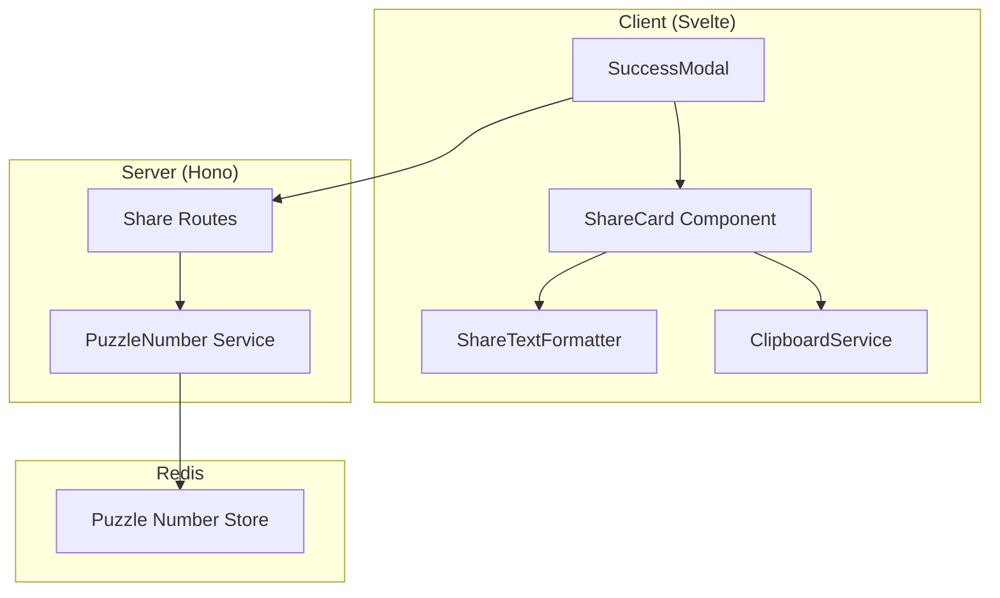

# Design Document: Shareable Results

## Overview

The Shareable Results feature enables players to share their Binary Grid puzzle completion in a visually appealing, spoiler-free format. The system generates a share card containing the day number, completion time, difficulty, and a grid representation using colored squares that show the pattern without revealing the actual solution.

The feature integrates into the existing SuccessModal component and provides two sharing mechanisms:
1. Clipboard copy for universal sharing
2. Direct Reddit comment posting for community engagement

## Architecture



### Data Flow

1. Player completes puzzle → SuccessModal opens
2. ShareCard component renders with current game state (grid, time, difficulty)
3. ShareTextFormatter generates copyable text representation
4. User actions:
   - Copy: ClipboardService copies formatted text
   - Share to Reddit: API call posts comment with share text

## Components and Interfaces

### ShareCard Component

A Svelte component that renders the visual share card preview.

```typescript
// ShareCard.svelte props
interface ShareCardProps {
  grid: Grid                    // Completed puzzle grid
  dayNumber: number             // Sequential puzzle number
  completionTime: number        // Time in seconds
  difficulty: Difficulty        // 'easy' | 'medium' | 'hard'
}
```

**Responsibilities:**
- Render spoiler-free grid using colored squares
- Display formatted time (MM:SS)
- Show day number and difficulty
- Provide visual preview of what will be shared

### ShareTextFormatter

A pure function module that generates the text representation of share results.

```typescript
// src/shared/share-formatter.ts

interface ShareTextInput {
  grid: Grid
  dayNumber: number
  completionTime: number
  difficulty: Difficulty
}

interface ShareTextOutput {
  text: string           // Full formatted share text
  gridText: string       // Just the grid portion
}

function formatShareText(input: ShareTextInput): ShareTextOutput
function formatGridAsText(grid: Grid): string
function formatTime(seconds: number): string
```

**Grid Character Mapping:**
- `0` → `⬜` (white square)
- `1` → `🟩` (green square)

**Output Format:**
```
Binary Grid #47 🧩
⏱️ 02:34 | 🎯 Medium

⬜🟩⬜🟩🟩⬜
🟩⬜🟩⬜⬜🟩
⬜🟩🟩⬜🟩⬜
🟩⬜⬜🟩⬜🟩
⬜🟩⬜🟩🟩⬜
🟩⬜🟩⬜⬜🟩

Play at r/binarygrid
```

### ClipboardService

A client-side service for clipboard operations.

```typescript
// src/client/services/clipboard.ts

interface CopyResult {
  success: boolean
  error?: string
}

async function copyToClipboard(text: string): Promise<CopyResult>
```

### Share API Endpoint

Extends existing server routes for share-related operations.

```typescript
// POST /api/share-comment
interface ShareCommentRequest {
  solveTimeSeconds: number
  difficulty: Difficulty
  dayNumber: number
}

interface ShareCommentResponse {
  ok: boolean
  error?: string
}
```

### PuzzleNumberService

Server-side service to track and retrieve sequential puzzle numbers.

```typescript
// src/server/core/puzzle-number.ts

async function getPuzzleNumber(postId: string): Promise<number>
async function getOrCreatePuzzleNumber(postId: string, dateISO: string): Promise<number>
```

## Data Models

### Share State (Client)

```typescript
// Extension to ui.ts store or new share.ts store
interface ShareState {
  isCopying: boolean
  copySuccess: boolean | null
  isSharing: boolean
  shareSuccess: boolean | null
  shareError: string | null
}
```

### Puzzle Number (Redis)

**Key patterns:**
- `puzzle:number:counter` — Global counter for puzzle numbers
- `puzzle:number:{postId}` — Maps postId to its puzzle number
- `puzzle:number:date:{dateISO}` — Maps date to puzzle number (for daily puzzles)

### Share Comment Tracking (Redis)

**Key pattern:**
- `share:comment:{postId}:{puzzleId}:{userId}` — Tracks if user has shared for this puzzle

## Correctness Properties

*A property is a characteristic or behavior that should hold true across all valid executions of a system—essentially, a formal statement about what the system should do. Properties serve as the bridge between human-readable specifications and machine-verifiable correctness guarantees.*

### Property 1: Share text contains all required sections

*For any* valid completed puzzle state (grid, day number, completion time, difficulty), the formatted share text SHALL contain the day number header, time and difficulty line, complete grid representation, and play link, each separated by newlines.

**Validates: Requirements 1.1, 2.3**

### Property 2: Grid cells map to correct Unicode characters

*For any* 6×6 grid of 0s and 1s, the grid formatter SHALL produce a string where every `0` maps to `⬜` and every `1` maps to `🟩`, with exactly 6 characters per row and 6 rows total.

**Validates: Requirements 1.2, 2.2**

### Property 3: Day number format validation

*For any* positive integer day number N, the formatted header SHALL match the pattern "Binary Grid #N 🧩" exactly.

**Validates: Requirements 1.3**

### Property 4: Time format round-trip

*For any* non-negative integer representing seconds, formatting to MM:SS and parsing back SHALL produce the original value (for values < 6000 seconds / 100 minutes).

**Validates: Requirements 1.4**

### Property 5: Share comment idempotency

*For any* user and puzzle combination, calling the share comment endpoint multiple times SHALL result in at most one comment being posted.

**Validates: Requirements 4.4**

## Error Handling

### Clipboard Errors

| Error Condition | Handling |
|----------------|----------|
| Clipboard API unavailable | Display error message, show share text in selectable textarea for manual copy |
| Clipboard write fails | Display error message with retry option |
| Permission denied | Display error message explaining clipboard permission requirement |

### Reddit Comment Errors

| Error Condition | Handling |
|----------------|----------|
| User not logged in | Display "Login required" message |
| Post ID unavailable | Display generic error, log for debugging |
| Reddit API failure | Display error message with reason from API |
| Rate limiting | Display "Please try again later" message |
| Duplicate submission | Silently succeed (idempotent), show success feedback |

### Data Validation Errors

| Error Condition | Handling |
|----------------|----------|
| Invalid grid data | Log error, disable share functionality |
| Missing day number | Fall back to date-based identifier |
| Invalid time value | Display "--:--" as fallback |

## Testing Strategy

### Unit Tests

Unit tests focus on specific examples and edge cases:

- ShareTextFormatter with known inputs produces expected output
- Time formatting edge cases: 0 seconds, 59 seconds, 60 seconds, 599 seconds
- Grid formatting with all 0s, all 1s, alternating pattern
- Day number formatting with single digit, double digit, triple digit numbers
- ClipboardService error handling when API unavailable

### Property-Based Tests

Property tests validate universal properties across randomized inputs using **fast-check** library:

- Each property test runs minimum 100 iterations
- Tests are tagged with format: **Feature: shareable-results, Property N: {property_text}**

**Property Test Coverage:**

1. **Share text completeness** - Generate random valid puzzle states, verify all sections present
2. **Grid character mapping** - Generate random 6×6 binary grids, verify character mapping
3. **Day number format** - Generate random positive integers, verify format pattern
4. **Time format round-trip** - Generate random seconds, verify format/parse round-trip
5. **Idempotency** - Simulate multiple share requests, verify single comment result

### Integration Tests

- ShareCard component renders correctly with various inputs
- Copy button triggers clipboard write with correct text
- Share to Reddit button triggers API call with correct payload
- Success modal displays share options alongside existing functionality

