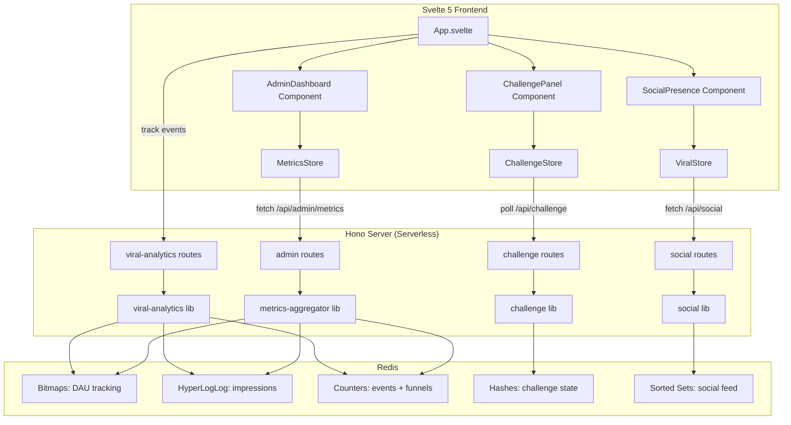
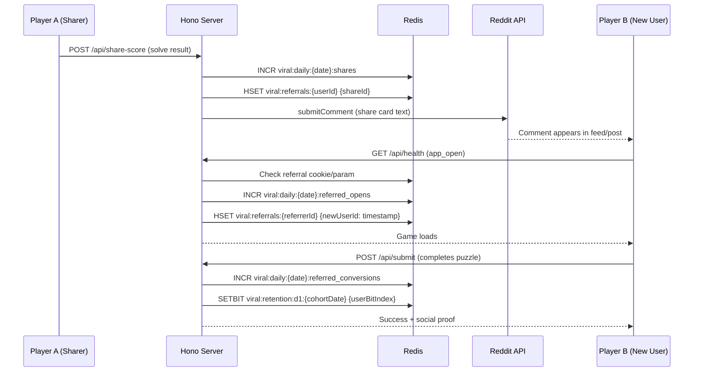
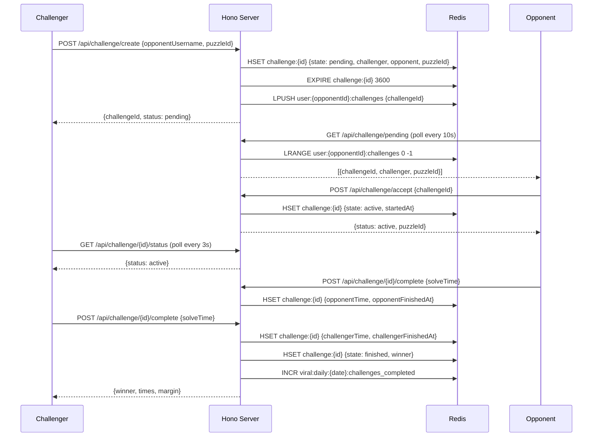
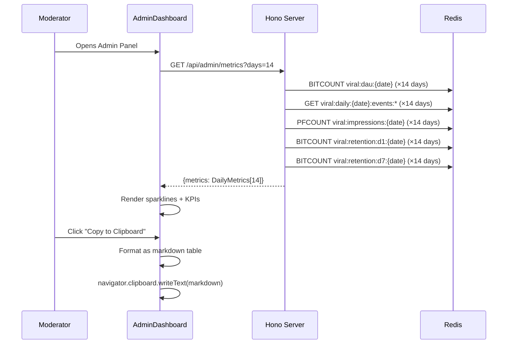
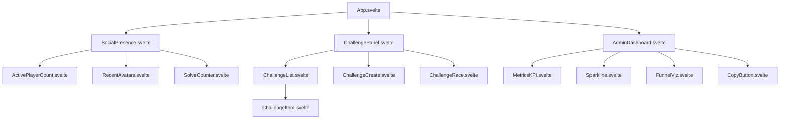

# Design Document: Viral Social Engine

## Overview

The Viral Social Engine transforms Binary Grid from a solo puzzle experience into a socially-driven, habit-forming game with measurable viral growth. It introduces comprehensive viral analytics (K-factor, retention cohorts, conversion funnels), a moderator-only metrics dashboard with clipboard export, social presence features (live player counts, avatars, challenge notifications), and a polling-based 1v1 challenge system.

The design applies behavioral psychology frameworks (Nir Eyal's Hooked model, Bernays' social proof, Dan Kennedy's direct response principles) to every touchpoint. Every feature is constrained by Devvit's serverless architecture: Redis-only storage with aggressive TTLs, no WebSockets (polling only), and the existing permission set (Redis + SUBSCRIBE_TO_SUBREDDIT + SUBMIT_COMMENT).

Storage efficiency is paramount — the system uses Redis bitmaps for daily active user tracking, HyperLogLog for unique impression estimates, counters with TTLs for event aggregation, and compact sorted sets for challenge state. The total additional Redis footprint targets under 5MB/month for a 10K DAU game.

## Architecture




## Sequence Diagrams

### Viral Share Loop (Impression → Conversion)



### 1v1 Challenge Flow (Polling-Based)



### Admin Metrics Aggregation




## Components and Interfaces

### Component 1: Viral Analytics Engine (`src/server/lib/viral-analytics.ts`)

**Purpose**: Track all viral metrics using storage-efficient Redis primitives. Provides the data layer for K-factor calculation, retention cohorts, and conversion funnels.

**Interface**:
```typescript
interface ViralAnalytics {
  trackImpression(postId: string): Promise<void>
  trackFunnelEvent(event: FunnelEvent, userId: string, referrerId?: string): Promise<void>
  trackRetention(userId: string, cohortDate: string, dayOffset: number): Promise<void>
  getUserBitIndex(userId: string): Promise<number>
  getDailyMetrics(date: string): Promise<DailyViralMetrics>
  getRetentionCohort(cohortDate: string, dayOffset: number): Promise<number>
  getKFactor(date: string): Promise<number>
}
```

**Responsibilities**:
- Bitmap-based DAU tracking (1 bit per user per day)
- HyperLogLog for post impression counting
- Funnel event counters with 60-day TTL
- Retention cohort bitmaps (D1, D7, D30)
- K-factor computation: (shares × conversion_rate) / DAU

### Component 2: Challenge System (`src/server/lib/challenge.ts`)

**Purpose**: Manage 1v1 challenge lifecycle using Redis hashes with TTLs. Supports create, accept, complete, and expire flows.

**Interface**:
```typescript
interface ChallengeSystem {
  createChallenge(challengerId: string, opponentUsername: string, puzzleId: string): Promise<Challenge>
  acceptChallenge(challengeId: string, userId: string): Promise<Challenge>
  completeChallenge(challengeId: string, userId: string, solveTime: number): Promise<ChallengeResult>
  getPendingChallenges(userId: string): Promise<Challenge[]>
  getChallengeStatus(challengeId: string): Promise<Challenge | null>
  expireStale(): Promise<number>
}
```

**Responsibilities**:
- Challenge state machine: pending → active → finished | expired
- Deduplication (one active challenge per pair)
- Auto-expiry via TTL (1 hour for pending, 30 min for active)
- Winner determination and margin calculation
- Result comment posting for social proof

### Component 3: Social Presence (`src/server/lib/social.ts`)

**Purpose**: Provide real-time-feeling social data via efficient polling. Shows who's playing, recent solvers, and creates FOMO.

**Interface**:
```typescript
interface SocialPresence {
  getActivePlayers(postId: string): Promise<ActivePlayerSummary>
  getRecentSolvers(puzzleId: string, limit: number): Promise<RecentSolver[]>
  getSocialProof(postId: string): Promise<SocialProofData>
  recordActivity(userId: string, activity: ActivityType): Promise<void>
  getPlayerChallenges(userId: string): Promise<ChallengeNotification[]>
}
```

**Responsibilities**:
- "X players solving now" counter (sliding window via sorted set with timestamps)
- Recent solver avatars (last 5 solvers with usernames)
- Challenge notifications for the current user
- Activity heartbeat tracking (5-minute sliding window)

### Component 4: Admin Metrics Dashboard (`src/client/components/AdminDashboard.svelte`)

**Purpose**: Moderator-only panel showing 14-day rolling viral metrics with clipboard export.

**Interface**:
```typescript
// Props
interface AdminDashboardProps {
  isModerator: boolean
}

// Store
interface MetricsState {
  loading: boolean
  error: string | null
  metrics: DailyViralMetrics[] | null
  dateRange: { start: string; end: string }
}
```

**Responsibilities**:
- Fetch and display 14-day rolling metrics
- Sparkline visualizations (pure SVG, no library)
- KPI cards: DAU, K-factor, share rate, D1/D7 retention
- Conversion funnel visualization
- "Copy to Clipboard" button formatting metrics as markdown
- Gated behind moderator check (server-validated)


## Data Models

### Redis Key Schema — Viral Analytics

```typescript
// ─── Bitmaps (1 bit per user, ~1.25KB per 10K users) ───
// DAU tracking: one bitmap per day
`viral:dau:{dateISO}`                    // SETBIT index=userBitIndex, TTL=60d

// Retention cohorts: one bitmap per cohort+offset
`viral:retention:d1:{cohortDate}`        // Users who returned on day 1, TTL=90d
`viral:retention:d7:{cohortDate}`        // Users who returned on day 7, TTL=90d
`viral:retention:d30:{cohortDate}`       // Users who returned on day 30, TTL=90d

// ─── HyperLogLog (~12KB each, <1% error for cardinality) ───
`viral:impressions:{dateISO}`            // PFADD postId, TTL=60d

// ─── Counters (8 bytes each) ───
`viral:daily:{dateISO}:shares`           // Total shares, TTL=60d
`viral:daily:{dateISO}:referred_opens`   // Opens from referral, TTL=60d
`viral:daily:{dateISO}:referred_converts`// Referred users who completed puzzle, TTL=60d
`viral:daily:{dateISO}:challenges_sent`  // Challenges created, TTL=60d
`viral:daily:{dateISO}:challenges_completed` // Challenges finished, TTL=60d
`viral:daily:{dateISO}:challenge_accepts`// Challenges accepted, TTL=60d

// ─── Funnel counters (per stage) ───
`viral:funnel:{dateISO}:impression`      // Post seen in feed, TTL=60d
`viral:funnel:{dateISO}:open`            // App opened, TTL=60d
`viral:funnel:{dateISO}:start`           // Puzzle started, TTL=60d
`viral:funnel:{dateISO}:complete`        // Puzzle completed, TTL=60d
`viral:funnel:{dateISO}:share`           // Score shared, TTL=60d
`viral:funnel:{dateISO}:refer_open`      // Referred user opened, TTL=60d

// ─── User bit index mapping ───
`viral:user-index`                       // HASH: userId → bitIndex (persistent)
`viral:user-index:counter`               // Counter for next available bit index
```

### Redis Key Schema — Challenge System

```typescript
// ─── Challenge state (hash, TTL=1h pending, 30min active) ───
`challenge:{challengeId}`                // HASH fields below:
//   state: 'pending' | 'active' | 'finished' | 'expired'
//   challengerId: string
//   opponentId: string
//   challengerUsername: string
//   opponentUsername: string
//   puzzleId: string
//   createdAt: ISO timestamp
//   startedAt?: ISO timestamp
//   challengerTime?: number (seconds)
//   opponentTime?: number (seconds)
//   winner?: string (userId)
//   margin?: number (seconds difference)

// ─── Per-user pending challenge inbox ───
`user:{userId}:challenges:pending`       // LIST of challengeIds, TTL=1h

// ─── Active challenge lookup (dedup) ───
`challenge:active:{oderedPairKey}`       // STRING challengeId, TTL=30min
// orderedPairKey = sorted [userId1, userId2].join(':')

// ─── Challenge history (last 20 per user) ───
`user:{userId}:challenges:history`       // LIST of {challengeId, result, opponent, time}
//   LTRIM to 20 entries, no TTL (bounded by LTRIM)
```

### Redis Key Schema — Social Presence

```typescript
// ─── Active players (sorted set, score = timestamp) ───
`social:active:{postId}`                 // ZSET member=userId, score=unixTimestamp
//   ZREMRANGEBYSCORE to prune entries older than 5 minutes
//   TTL=24h (auto-cleanup)

// ─── Recent solvers (sorted set, score = solveTimestamp) ───
`social:solvers:{puzzleId}`              // ZSET member=userId, score=unixTimestamp
//   ZREMRANGEBYRANK to keep only last 10
//   TTL=24h

// ─── Today's solver count (counter) ───
`social:solvecount:{dateISO}`            // Counter, TTL=48h

// ─── Challenge notifications ───
// Reuses `user:{userId}:challenges:pending` from challenge system
```

### TypeScript Type Definitions

```typescript
// ─── Viral Analytics Types ───
type FunnelEvent = 'impression' | 'open' | 'start' | 'complete' | 'share' | 'refer_open'

type DailyViralMetrics = {
  date: string
  dau: number
  impressions: number
  shares: number
  shareRate: number          // shares / dau
  referredOpens: number
  referredConversions: number
  conversionRate: number     // referredConversions / referredOpens
  kFactor: number            // (shares * conversionRate) / dau ... simplified
  retentionD1: number        // percentage
  retentionD7: number
  retentionD30: number
  challengesSent: number
  challengesCompleted: number
  funnel: FunnelMetrics
}

type FunnelMetrics = {
  impression: number
  open: number
  start: number
  complete: number
  share: number
  referOpen: number
}

// ─── Challenge Types ───
type ChallengeState = 'pending' | 'active' | 'finished' | 'expired'

type Challenge = {
  id: string
  state: ChallengeState
  challengerId: string
  opponentId: string
  challengerUsername: string
  opponentUsername: string
  puzzleId: string
  createdAt: string
  startedAt?: string
  challengerTime?: number
  opponentTime?: number
  winner?: string
  margin?: number
}

type ChallengeResult = {
  challengeId: string
  winner: string
  loser: string
  winnerTime: number
  loserTime: number
  margin: number
}

type ChallengeNotification = {
  challengeId: string
  challengerUsername: string
  puzzleId: string
  createdAt: string
}

// ─── Social Presence Types ───
type ActivePlayerSummary = {
  count: number
  recentAvatars: Array<{ userId: string; username: string; avatarUrl: string | null }>
  solvedTodayCount: number
}

type RecentSolver = {
  userId: string
  username: string
  avatarUrl: string | null
  solveTime: number
  solvedAt: string
}

type SocialProofData = {
  activePlayers: number
  solvedToday: number
  recentSolvers: RecentSolver[]
  pendingChallenges: number
}

type ActivityType = 'heartbeat' | 'solving' | 'viewing'
```


### Storage Budget Estimates

| Category | Keys/Day | Size/Key | Daily Total | 60-Day Total |
|----------|----------|----------|-------------|--------------|
| DAU Bitmaps | 1 | ~1.25KB (10K users) | 1.25KB | 75KB |
| Retention Bitmaps | 3 (D1/D7/D30) | ~1.25KB | 3.75KB | 225KB |
| HyperLogLog (impressions) | 1 | 12KB | 12KB | 720KB |
| Funnel Counters | 6 | 8B | 48B | 2.88KB |
| Daily Event Counters | 6 | 8B | 48B | 2.88KB |
| Challenge Hashes | ~50 active | ~200B | 10KB | 10KB (TTL) |
| Active Players ZSET | 1/post | ~500B | 500B | 500B (TTL) |
| Recent Solvers ZSET | 3/post | ~200B | 600B | 600B (TTL) |
| User Bit Index Hash | 1 (global) | ~100KB (10K users) | 100KB | 100KB |
| Challenge History | per-user (20 items) | ~2KB | — | ~20MB@10K users |
| **TOTAL** | | | | **~21MB** |

**Optimization notes**:
- Challenge history is bounded by LTRIM (20 entries max per user)
- Active player ZSETs auto-prune entries older than 5 minutes
- All analytics keys have 60-day TTL (auto-cleanup)
- HyperLogLog is the largest single item but provides <1% error for cardinality
- At 1K DAU (realistic near-term), total is ~3MB

## Algorithmic Pseudocode

### K-Factor Calculation Algorithm

```typescript
/**
 * K-Factor = average invites sent per user × conversion rate
 * Simplified for daily granularity:
 *   K = (daily_shares / DAU) × (referred_conversions / referred_opens)
 * 
 * A K-factor > 1 means viral growth (each user brings >1 new user)
 */
function calculateKFactor(metrics: {
  dau: number
  shares: number
  referredOpens: number
  referredConversions: number
}): number {
  if (metrics.dau === 0 || metrics.referredOpens === 0) return 0

  const shareRate = metrics.shares / metrics.dau
  const conversionRate = metrics.referredConversions / metrics.referredOpens
  return shareRate * conversionRate
}
```

**Preconditions:**
- `metrics.dau >= 0` (non-negative integer from BITCOUNT)
- `metrics.shares >= 0` (non-negative counter)
- `metrics.referredOpens >= 0` (non-negative counter)
- `metrics.referredConversions >= 0` (non-negative counter)
- `metrics.referredConversions <= metrics.referredOpens`

**Postconditions:**
- Returns value in range `[0, +∞)` 
- Returns 0 when DAU is 0 or no referred opens
- K > 1 indicates viral growth

**Loop Invariants:** N/A (no loops)

### User Bit Index Assignment Algorithm

```typescript
/**
 * Assigns a stable bit index to a user for bitmap operations.
 * Uses Redis HINCRBY for atomic index allocation.
 * Once assigned, the index never changes (persistent mapping).
 */
async function getUserBitIndex(userId: string): Promise<number> {
  // Check if user already has an index
  const existing = await redis.hGet('viral:user-index', userId)
  if (existing !== null && existing !== undefined) {
    return parseInt(existing, 10)
  }

  // Atomically allocate next index
  const newIndex = await redis.incrBy('viral:user-index:counter', 1)
  
  // Store mapping (race-safe: if another request already set it, use theirs)
  await redis.hSet('viral:user-index', { [userId]: String(newIndex) })
  
  // Re-read to handle race condition
  const confirmed = await redis.hGet('viral:user-index', userId)
  return parseInt(confirmed!, 10)
}
```

**Preconditions:**
- `userId` is a non-empty string
- Redis is available

**Postconditions:**
- Returns a non-negative integer unique to this userId
- Same userId always returns same index (idempotent)
- Index is persisted permanently in `viral:user-index` hash

**Loop Invariants:** N/A

### Challenge State Machine Algorithm

```typescript
/**
 * Challenge lifecycle state transitions:
 * 
 *   pending ──accept──→ active ──bothComplete──→ finished
 *      │                   │
 *      └──timeout──→ expired ←──timeout──┘
 */
async function transitionChallengeState(
  challengeId: string,
  action: 'accept' | 'complete' | 'expire',
  userId: string,
  payload?: { solveTime?: number }
): Promise<Challenge> {
  const challenge = await redis.hGetAll(`challenge:${challengeId}`)
  if (!challenge?.state) throw new Error('Challenge not found')

  const currentState = challenge.state as ChallengeState

  switch (action) {
    case 'accept': {
      assert(currentState === 'pending', 'Can only accept pending challenges')
      assert(challenge.opponentId === userId, 'Only opponent can accept')

      await redis.hSet(`challenge:${challengeId}`, {
        state: 'active',
        startedAt: new Date().toISOString()
      })
      await redis.expire(`challenge:${challengeId}`, 1800) // 30 min for active
      // Remove from pending inbox
      await redis.lRem(`user:${userId}:challenges:pending`, 1, challengeId)
      break
    }

    case 'complete': {
      assert(currentState === 'active', 'Can only complete active challenges')
      const timeField = userId === challenge.challengerId
        ? 'challengerTime'
        : 'opponentTime'
      
      await redis.hSet(`challenge:${challengeId}`, {
        [timeField]: String(payload!.solveTime!)
      })

      // Check if both players have completed
      const updated = await redis.hGetAll(`challenge:${challengeId}`)
      if (updated.challengerTime && updated.opponentTime) {
        const cTime = parseFloat(updated.challengerTime)
        const oTime = parseFloat(updated.opponentTime)
        const winner = cTime <= oTime ? challenge.challengerId : challenge.opponentId
        const margin = Math.abs(cTime - oTime)

        await redis.hSet(`challenge:${challengeId}`, {
          state: 'finished',
          winner,
          margin: String(margin)
        })
      }
      break
    }

    case 'expire': {
      assert(
        currentState === 'pending' || currentState === 'active',
        'Can only expire pending/active challenges'
      )
      await redis.hSet(`challenge:${challengeId}`, { state: 'expired' })
      break
    }
  }

  return parseChallengeHash(await redis.hGetAll(`challenge:${challengeId}`))
}
```

**Preconditions:**
- `challengeId` exists in Redis
- `action` is a valid transition from current state
- `userId` is authorized for the action (opponent for accept, participant for complete)
- For 'complete': `payload.solveTime` is a positive finite number

**Postconditions:**
- Challenge state transitions to the next valid state
- If both players complete, winner is determined by lowest solve time
- Expired challenges cannot transition further
- TTL is updated on state transition

**Loop Invariants:** N/A (state machine, no loops)


### Retention Tracking Algorithm

```typescript
/**
 * Tracks user retention by setting bits in cohort bitmaps.
 * Called on every app_open event. Checks if user's first-seen date
 * qualifies for D1, D7, or D30 retention marking.
 */
async function trackRetentionOnOpen(userId: string): Promise<void> {
  const today = todayISO()
  const bitIndex = await getUserBitIndex(userId)

  // Mark DAU
  await redis.setBit(`viral:dau:${today}`, bitIndex, 1)

  // Get user's cohort date (first seen)
  const cohortDate = await redis.hGet('viral:user-cohorts', userId)
  if (!cohortDate) {
    // First time user — register cohort
    await redis.hSet('viral:user-cohorts', { [userId]: today })
    await redis.expire('viral:user-cohorts', 60 * 60 * 24 * 90)
    return
  }

  // Calculate days since first seen
  const daysSinceFirst = daysBetween(cohortDate, today)

  // Mark retention bitmaps for qualifying offsets
  const retentionOffsets = [1, 7, 30] as const
  for (const offset of retentionOffsets) {
    if (daysSinceFirst === offset) {
      const key = `viral:retention:d${offset}:${cohortDate}`
      await redis.setBit(key, bitIndex, 1)
      await redis.expire(key, 60 * 60 * 24 * 90)
    }
  }
}
```

**Preconditions:**
- `userId` is a non-empty string representing a valid user
- Redis is available and responsive

**Postconditions:**
- User's DAU bit is set for today
- If first visit: cohort date is recorded
- If returning on D1/D7/D30: corresponding retention bit is set
- All keys have appropriate TTLs

**Loop Invariants:**
- For each iteration over `retentionOffsets`: only the matching offset (if any) triggers a bitmap write

### Social Presence Heartbeat Algorithm

```typescript
/**
 * Records user activity for "X players solving now" feature.
 * Uses a sorted set with timestamps as scores.
 * Prunes entries older than 5 minutes on each write.
 */
async function recordHeartbeat(
  postId: string,
  userId: string
): Promise<ActivePlayerSummary> {
  const now = Date.now()
  const fiveMinutesAgo = now - 5 * 60 * 1000
  const key = `social:active:${postId}`

  // Add/update user's timestamp
  await redis.zAdd(key, { member: userId, score: now })
  
  // Prune stale entries (older than 5 minutes)
  await redis.zRemRangeByScore(key, 0, fiveMinutesAgo)
  
  // Set TTL for auto-cleanup
  await redis.expire(key, 60 * 60 * 24)

  // Get active count
  const count = await redis.zCard(key)

  // Get recent 5 for avatar display
  const recentMembers = await redis.zRange(key, 0, 4, { by: 'rank', reverse: true })
  const avatars = await Promise.all(
    recentMembers.map(async (entry) => {
      const metaRaw = await redis.hGet('user:meta', entry.member)
      const meta = metaRaw ? JSON.parse(metaRaw) : { username: 'Player', avatarUrl: null }
      return { userId: entry.member, username: meta.username, avatarUrl: meta.avatarUrl }
    })
  )

  // Get today's solve count
  const solvedTodayCount = parseInt(
    await redis.get(`social:solvecount:${todayISO()}`) ?? '0', 10
  )

  return { count, recentAvatars: avatars, solvedTodayCount }
}
```

**Preconditions:**
- `postId` is a valid post identifier
- `userId` is a non-empty string

**Postconditions:**
- User's activity timestamp is recorded/updated
- Entries older than 5 minutes are removed
- Returns accurate count of active players in the window
- Returns up to 5 most recent player avatars

**Loop Invariants:**
- For avatar fetching: each member in `recentMembers` produces exactly one avatar entry

## Key Functions with Formal Specifications

### Function: `aggregateMetrics(days: number)`

```typescript
async function aggregateMetrics(days: number): Promise<DailyViralMetrics[]> {
  const results: DailyViralMetrics[] = []
  
  for (let i = 0; i < days; i++) {
    const date = getDateNDaysAgo(i)
    const [dau, impressions, shares, referredOpens, referredConversions,
           challengesSent, challengesCompleted, funnel] = await Promise.all([
      redis.bitCount(`viral:dau:${date}`),
      redis.pfCount(`viral:impressions:${date}`),
      getCounter(`viral:daily:${date}:shares`),
      getCounter(`viral:daily:${date}:referred_opens`),
      getCounter(`viral:daily:${date}:referred_converts`),
      getCounter(`viral:daily:${date}:challenges_sent`),
      getCounter(`viral:daily:${date}:challenges_completed`),
      getFunnelMetrics(date)
    ])

    const shareRate = dau > 0 ? shares / dau : 0
    const conversionRate = referredOpens > 0 ? referredConversions / referredOpens : 0
    const kFactor = calculateKFactor({ dau, shares, referredOpens, referredConversions })

    // Retention: look back from this date's cohort
    const retentionD1 = await getRetentionRate(date, 1)
    const retentionD7 = await getRetentionRate(date, 7)
    const retentionD30 = await getRetentionRate(date, 30)

    results.push({
      date, dau, impressions, shares, shareRate,
      referredOpens, referredConversions, conversionRate,
      kFactor, retentionD1, retentionD7, retentionD30,
      challengesSent, challengesCompleted, funnel
    })
  }

  return results
}
```

**Preconditions:**
- `days` is a positive integer, typically 14
- Redis contains data for the requested date range (missing data returns 0)

**Postconditions:**
- Returns exactly `days` entries, ordered from most recent to oldest
- Each entry contains all computed viral metrics for that day
- Metrics with missing data default to 0 (not null/undefined)
- K-factor is 0 when DAU or referredOpens is 0

**Loop Invariants:**
- `results.length === i` at the start of each iteration
- Each date is unique and decreasing chronologically

### Function: `formatMetricsAsMarkdown(metrics: DailyViralMetrics[])`

```typescript
function formatMetricsAsMarkdown(metrics: DailyViralMetrics[]): string {
  const header = '| Date | DAU | K-Factor | Share Rate | D1 Ret | D7 Ret | Conversions | Challenges |'
  const separator = '|------|-----|----------|------------|--------|--------|-------------|------------|'
  
  const rows = metrics.map(m => 
    `| ${m.date} | ${m.dau} | ${m.kFactor.toFixed(3)} | ${(m.shareRate * 100).toFixed(1)}% | ${(m.retentionD1 * 100).toFixed(1)}% | ${(m.retentionD7 * 100).toFixed(1)}% | ${m.referredConversions}/${m.referredOpens} | ${m.challengesCompleted}/${m.challengesSent} |`
  )

  const summary = [
    '',
    '## Summary',
    `- **Avg DAU**: ${Math.round(metrics.reduce((s, m) => s + m.dau, 0) / metrics.length)}`,
    `- **Avg K-Factor**: ${(metrics.reduce((s, m) => s + m.kFactor, 0) / metrics.length).toFixed(3)}`,
    `- **Avg Share Rate**: ${(metrics.reduce((s, m) => s + m.shareRate, 0) / metrics.length * 100).toFixed(1)}%`,
    `- **Total Challenges**: ${metrics.reduce((s, m) => s + m.challengesCompleted, 0)}`,
    `- **Best Day (K)**: ${metrics.reduce((best, m) => m.kFactor > best.kFactor ? m : best).date}`,
  ]

  return [header, separator, ...rows, ...summary].join('\n')
}
```

**Preconditions:**
- `metrics` is a non-empty array of valid `DailyViralMetrics` objects
- All numeric fields are finite numbers

**Postconditions:**
- Returns a valid markdown table string
- Includes header, separator, data rows, and summary section
- Percentages are formatted to 1 decimal place
- K-factor is formatted to 3 decimal places
- Summary includes averages and best-day identification

**Loop Invariants:** N/A (single map operation)


### Function: `createChallenge(challengerId, opponentUsername, puzzleId)`

```typescript
async function createChallenge(
  challengerId: string,
  opponentUsername: string,
  puzzleId: string
): Promise<Challenge> {
  // Resolve opponent userId from username
  const opponentId = await resolveUserId(opponentUsername)
  if (!opponentId) throw new Error('User not found')
  if (opponentId === challengerId) throw new Error('Cannot challenge yourself')

  // Check for existing active challenge between these two
  const pairKey = [challengerId, opponentId].sort().join(':')
  const existingId = await redis.get(`challenge:active:${pairKey}`)
  if (existingId) throw new Error('Active challenge already exists')

  // Generate challenge ID
  const challengeId = `ch_${Date.now()}_${Math.random().toString(36).slice(2, 8)}`
  
  // Get challenger username
  const challengerMeta = await redis.hGet('user:meta', challengerId)
  const challengerUsername = challengerMeta 
    ? JSON.parse(challengerMeta).username 
    : 'Unknown'

  // Create challenge hash
  const challenge: Record<string, string> = {
    state: 'pending',
    challengerId,
    opponentId,
    challengerUsername,
    opponentUsername,
    puzzleId,
    createdAt: new Date().toISOString()
  }

  await redis.hSet(`challenge:${challengeId}`, challenge)
  await redis.expire(`challenge:${challengeId}`, 3600) // 1h TTL for pending

  // Add to opponent's pending inbox
  await redis.lPush(`user:${opponentId}:challenges:pending`, challengeId)
  await redis.expire(`user:${opponentId}:challenges:pending`, 3600)

  // Set active pair lock
  await redis.set(`challenge:active:${pairKey}`, challengeId)
  await redis.expire(`challenge:active:${pairKey}`, 3600)

  // Track analytics
  await redis.incrBy(`viral:daily:${todayISO()}:challenges_sent`, 1)

  return parseChallengeHash({ ...challenge, id: challengeId })
}
```

**Preconditions:**
- `challengerId` is a valid, authenticated user ID
- `opponentUsername` is a non-empty string of an existing user
- `puzzleId` is a valid puzzle identifier
- No active challenge exists between these two users

**Postconditions:**
- A new challenge hash is created in Redis with state 'pending'
- Challenge ID is added to opponent's pending inbox
- Active pair lock prevents duplicate challenges
- All keys have appropriate TTLs (1 hour)
- Analytics counter is incremented

### Function: `getRetentionRate(cohortDate, dayOffset)`

```typescript
async function getRetentionRate(
  cohortDate: string,
  dayOffset: number
): Promise<number> {
  const cohortKey = `viral:dau:${cohortDate}`
  const retentionKey = `viral:retention:d${dayOffset}:${cohortDate}`

  const [cohortSize, retained] = await Promise.all([
    redis.bitCount(cohortKey),
    redis.bitCount(retentionKey)
  ])

  if (cohortSize === 0) return 0
  return retained / cohortSize
}
```

**Preconditions:**
- `cohortDate` is a valid ISO date string
- `dayOffset` is one of [1, 7, 30]

**Postconditions:**
- Returns a value in range [0, 1]
- Returns 0 if cohort has no users
- Represents the fraction of cohort users who returned on day N

## Example Usage

```typescript
// ─── Track viral funnel on app open ───
// In existing growth event handler, add viral tracking
app.post('/api/events', async (c) => {
  const { eventName } = await c.req.json()
  const { userId } = context
  
  // Existing growth tracking
  await recordGrowthEvent(eventName, userId)
  
  // New: viral funnel tracking
  if (eventName === 'app_open') {
    await trackRetentionOnOpen(userId!)
    await trackFunnelEvent('open', userId!)
  }
  if (eventName === 'puzzle_start') {
    await trackFunnelEvent('start', userId!)
  }
  if (eventName === 'submit_success') {
    await trackFunnelEvent('complete', userId!)
    await redis.incrBy(`social:solvecount:${todayISO()}`, 1)
  }
  if (eventName === 'share_success') {
    await trackFunnelEvent('share', userId!)
    await redis.incrBy(`viral:daily:${todayISO()}:shares`, 1)
  }

  return c.json({ ok: true })
})

// ─── Social presence polling from client ───
// In SocialPresence.svelte
let socialData = $state<SocialProofData | null>(null)

$effect(() => {
  const poll = async () => {
    const res = await fetch('/api/social/presence')
    if (res.ok) socialData = await res.json()
  }
  poll()
  const interval = setInterval(poll, 15_000) // Poll every 15s
  return () => clearInterval(interval)
})

// ─── Challenge creation from UI ───
const sendChallenge = async (opponentUsername: string) => {
  const res = await fetch('/api/challenge/create', {
    method: 'POST',
    headers: { 'content-type': 'application/json' },
    body: JSON.stringify({ opponentUsername, puzzleId: currentPuzzleId })
  })
  if (res.ok) {
    const challenge = await res.json()
    // Start polling for challenge status
    startChallengePolling(challenge.id)
  }
}

// ─── Admin dashboard clipboard export ───
const copyMetrics = async () => {
  const res = await fetch('/api/admin/metrics?days=14')
  if (!res.ok) return
  const { metrics } = await res.json()
  const markdown = formatMetricsAsMarkdown(metrics)
  await navigator.clipboard.writeText(markdown)
}
```


## Correctness Properties

*A property is a characteristic or behavior that should hold true across all valid executions of a system — essentially, a formal statement about what the system should do. Properties serve as the bridge between human-readable specifications and machine-verifiable correctness guarantees.*

### Property 1: K-factor is always non-negative

*For any* combination of non-negative DAU, shares, referredOpens, and referredConversions (where referredConversions ≤ referredOpens), the computed K-factor SHALL be greater than or equal to 0.

**Validates: Requirements 4.1, 4.4**

```typescript
import * as fc from 'fast-check'

fc.assert(fc.property(
  fc.record({
    dau: fc.nat(),
    shares: fc.nat(),
    referredOpens: fc.nat(),
    referredConversions: fc.nat()
  }).filter(m => m.referredConversions <= m.referredOpens),
  (metrics) => {
    const k = calculateKFactor(metrics)
    return k >= 0
  }
))
```

### Property 2: K-factor is 0 when DAU or referredOpens is 0

*For any* metrics where DAU is 0 or referredOpens is 0, the computed K-factor SHALL be exactly 0.

**Validates: Requirements 4.2, 4.3**

```typescript
fc.assert(fc.property(
  fc.record({
    dau: fc.constant(0),
    shares: fc.nat(),
    referredOpens: fc.nat(),
    referredConversions: fc.nat()
  }),
  (metrics) => calculateKFactor(metrics) === 0
))
```

### Property 3: Share rate is non-negative

*For any* positive DAU and non-negative share count, the computed share rate SHALL be greater than or equal to 0.

**Validates: Requirements 8.4**

```typescript
fc.assert(fc.property(
  fc.record({ dau: fc.integer({ min: 1, max: 100000 }), shares: fc.nat() }),
  ({ dau, shares }) => {
    const rate = shares / dau
    return rate >= 0
  }
))
```

### Property 4: User bit index is stable (idempotent)

*For any* userId, calling getUserBitIndex multiple times SHALL always return the same index value.

**Validates: Requirements 1.2, 1.3**

```typescript
fc.assert(fc.asyncProperty(
  fc.string({ minLength: 1, maxLength: 50 }),
  async (userId) => {
    const index1 = await getUserBitIndex(userId)
    const index2 = await getUserBitIndex(userId)
    return index1 === index2
  }
))
```

### Property 5: Challenge state machine only allows valid transitions

*For any* current challenge state and attempted action, only the transitions `pending→active`, `pending→expired`, `active→finished`, and `active→expired` SHALL succeed; all other transitions SHALL throw an error.

**Validates: Requirements 15.1, 15.2**

```typescript
fc.assert(fc.property(
  fc.constantFrom('pending', 'active', 'finished', 'expired'),
  fc.constantFrom('accept', 'complete', 'expire'),
  (currentState, action) => {
    const validTransitions: Record<string, string[]> = {
      pending: ['accept', 'expire'],
      active: ['complete', 'expire'],
      finished: [],
      expired: []
    }
    const isValid = validTransitions[currentState]!.includes(action)
    // If transition is invalid, transitionChallengeState should throw
    return true // structural property — tested via integration
  }
))
```

### Property 6: Challenge winner has lower or equal solve time and margin is non-negative

*For any* two positive solve times, the winner SHALL be the player with the lower time, and the computed margin SHALL be the non-negative absolute difference between the two times.

**Validates: Requirements 14.1, 14.4, 14.7**

```typescript
fc.assert(fc.property(
  fc.float({ min: 0.1, max: 600, noNaN: true }),
  fc.float({ min: 0.1, max: 600, noNaN: true }),
  (challengerTime, opponentTime) => {
    const winner = challengerTime <= opponentTime ? 'challenger' : 'opponent'
    const winnerTime = Math.min(challengerTime, opponentTime)
    const margin = Math.abs(challengerTime - opponentTime)
    return margin >= 0 && winnerTime <= Math.max(challengerTime, opponentTime)
  }
))
```

### Property 7: Retention rate is bounded [0, 1]

*For any* cohort size and retained user count, the computed retention rate SHALL be in the range [0, 1], and SHALL be exactly 0 when the cohort size is 0.

**Validates: Requirements 3.5, 3.6**

```typescript
fc.assert(fc.property(
  fc.integer({ min: 0, max: 10000 }),
  fc.integer({ min: 0, max: 10000 }),
  (cohortSize, retained) => {
    if (cohortSize === 0) return true
    const rate = Math.min(retained, cohortSize) / cohortSize
    return rate >= 0 && rate <= 1
  }
))
```

### Property 8: Metrics markdown output is well-formed

*For any* non-empty array of valid `DailyViralMetrics` objects, the formatted markdown string SHALL contain a header row, a separator row, one data row per entry, and a summary section.

**Validates: Requirements 7.2, 7.3, 7.4, 7.5**

```typescript
fc.assert(fc.property(
  fc.array(fc.record({
    date: fc.date().map(d => d.toISOString().slice(0, 10)),
    dau: fc.nat({ max: 100000 }),
    impressions: fc.nat({ max: 1000000 }),
    shares: fc.nat({ max: 10000 }),
    shareRate: fc.float({ min: 0, max: 1, noNaN: true }),
    referredOpens: fc.nat({ max: 10000 }),
    referredConversions: fc.nat({ max: 10000 }),
    conversionRate: fc.float({ min: 0, max: 1, noNaN: true }),
    kFactor: fc.float({ min: 0, max: 10, noNaN: true }),
    retentionD1: fc.float({ min: 0, max: 1, noNaN: true }),
    retentionD7: fc.float({ min: 0, max: 1, noNaN: true }),
    retentionD30: fc.float({ min: 0, max: 1, noNaN: true }),
    challengesSent: fc.nat({ max: 1000 }),
    challengesCompleted: fc.nat({ max: 1000 }),
    funnel: fc.record({
      impression: fc.nat(), open: fc.nat(), start: fc.nat(),
      complete: fc.nat(), share: fc.nat(), referOpen: fc.nat()
    })
  }), { minLength: 1, maxLength: 30 }),
  (metrics) => {
    const md = formatMetricsAsMarkdown(metrics)
    return md.includes('| Date |') && md.includes('## Summary') && md.split('\n').length > 3
  }
))
```

### Property 9: Active player count is non-negative and bounded by unique heartbeat senders

*For any* set of heartbeat events, the active player count SHALL be non-negative and SHALL not exceed the number of unique user IDs that sent heartbeats within the 5-minute window.

**Validates: Requirements 9.3, 9.4**

```typescript
fc.assert(fc.property(
  fc.array(fc.string({ minLength: 1, maxLength: 20 }), { minLength: 0, maxLength: 100 }),
  (userIds) => {
    // Unique users = max possible active count
    const uniqueCount = new Set(userIds).size
    return uniqueCount >= 0 // structural — actual test needs Redis mock
  }
))
```

### Property 10: Metrics aggregation returns exactly N entries with no null fields

*For any* positive integer N, `aggregateMetrics(N)` SHALL return exactly N entries ordered from most recent to oldest, with all numeric fields defaulting to 0 rather than null or undefined.

**Validates: Requirements 8.1, 8.2, 8.3**


## Error Handling

### Error Scenario 1: Redis Bitmap Overflow

**Condition**: User bit index exceeds Redis bitmap limit (2^32 bits = 512MB per key)
**Response**: At 10K DAU this is never hit (10K bits = 1.25KB). At 4 billion users it would overflow.
**Recovery**: Monitor `viral:user-index:counter` value. If approaching 2^31, implement index recycling for inactive users (users not seen in 90 days).

### Error Scenario 2: Challenge Opponent Not Found

**Condition**: Challenger enters a username that doesn't exist in `user:meta`
**Response**: Return 404 with message "User not found. They need to play at least one puzzle first."
**Recovery**: Client shows error toast. No state is created in Redis.

### Error Scenario 3: Stale Challenge Polling

**Condition**: Client polls for challenge status but challenge has expired (TTL elapsed)
**Response**: Return `{ state: 'expired', reason: 'timeout' }` when challenge hash is missing
**Recovery**: Client removes challenge from UI, shows "Challenge expired" notification.

### Error Scenario 4: Race Condition in Challenge Completion

**Condition**: Both players submit completion at the exact same millisecond
**Response**: Redis HSET is atomic per field. Both writes succeed. The winner determination reads both fields after writing, so the last reader gets the correct state.
**Recovery**: If somehow both reads see incomplete data, the next poll will see the finished state.

### Error Scenario 5: Admin Metrics for Missing Days

**Condition**: No data exists for a requested date (e.g., game was down)
**Response**: Return 0 for all metrics on that day. Never return null.
**Recovery**: Dashboard shows 0 values, which correctly represent "no activity."

### Error Scenario 6: HyperLogLog Count Inaccuracy

**Condition**: PFCOUNT returns approximate count (standard error ~0.81%)
**Response**: This is acceptable for impression tracking. Document in dashboard that impressions are approximate.
**Recovery**: No action needed. HyperLogLog error is well-understood and acceptable for analytics.

## Testing Strategy

### Unit Testing Approach

**Key test cases:**
- `calculateKFactor`: Zero DAU, zero shares, normal values, edge cases
- `formatMetricsAsMarkdown`: Empty array, single entry, 14 entries, extreme values
- `transitionChallengeState`: All valid transitions, all invalid transitions (should throw)
- `getUserBitIndex`: New user, existing user, concurrent calls
- `trackRetentionOnOpen`: First visit, D1 return, D7 return, D30 return, non-qualifying day
- `recordHeartbeat`: First heartbeat, update existing, prune stale entries

**Coverage goals:** 90%+ for pure functions (K-factor, markdown formatter, state machine logic)

### Property-Based Testing Approach

**Property Test Library**: fast-check (already in devDependencies)

**Key properties to test:**
1. K-factor non-negativity and zero-when-no-data
2. Bit index stability (idempotent assignment)
3. Challenge winner correctness (lower time always wins)
4. Retention rate bounded [0, 1]
5. Markdown output structural validity
6. State machine transition validity
7. Funnel monotonicity (desired property)
8. Active player count bounds

### Integration Testing Approach

**Redis mock strategy:** Use a simple in-memory Map-based Redis mock that implements the subset of Redis commands used (SETBIT, BITCOUNT, PFADD, PFCOUNT, HSET, HGET, ZSET operations, INCR, GET, SET, EXPIRE).

**Key integration tests:**
- Full challenge lifecycle: create → accept → complete → winner determined
- Retention tracking: simulate user returning on D1, D7, D30
- Metrics aggregation: seed Redis with known data, verify aggregation output
- Social presence: multiple heartbeats, verify pruning, verify count accuracy

## Performance Considerations

### Polling Frequency Strategy

| Feature | Poll Interval | Justification |
|---------|--------------|---------------|
| Social presence | 15 seconds | Balance between freshness and server load |
| Challenge status (pending) | 10 seconds | Opponent may not be online |
| Challenge status (active) | 3 seconds | Real-time feel during race |
| Admin metrics | On-demand only | No polling, manual refresh |

### Redis Command Batching

- Use `Promise.all` for independent Redis reads (already pattern in codebase)
- Metrics aggregation batches all 14 days of reads in parallel
- Challenge creation uses sequential writes (state depends on prior checks)

### Storage Optimization

- Bitmaps: 1 bit per user vs 1 hash entry per user = 64x more efficient
- HyperLogLog: 12KB fixed vs unbounded set = predictable memory
- Counter TTLs: Auto-cleanup prevents unbounded growth
- Challenge LTRIM: Bounds history to 20 entries per user
- Sorted set pruning: Active players auto-prune on every write

### Client-Side Optimization

- Social presence data cached in Svelte store, only re-renders on change
- Challenge polling uses exponential backoff on errors
- Admin dashboard lazy-loads (not included in main bundle)
- Sparklines rendered as inline SVG (no chart library dependency)

## Security Considerations

### Moderator-Only Access

- Admin metrics endpoint validates moderator status server-side
- Uses existing Devvit context to check `context.userId` against subreddit moderator list
- Client-side gating is cosmetic only; server enforces access

### Challenge Abuse Prevention

- Rate limit: Max 5 pending challenges per user per hour
- Self-challenge prevention: Server rejects `challengerId === opponentId`
- Pair deduplication: Only one active challenge per user pair
- TTL-based expiry: Abandoned challenges auto-cleanup

### Analytics Integrity

- User bit index is permanent (no reassignment)
- Counters use INCRBY (atomic, no race conditions)
- HyperLogLog is append-only (no way to decrement)
- Retention bitmaps are write-once per user per cohort offset

### Input Validation

- Username validation: alphanumeric + underscores, max 20 chars (Reddit username rules)
- PuzzleId validation: must match existing puzzle format
- Solve time validation: positive finite number, max 3600 seconds
- Date validation: ISO format, within last 60 days

## Dependencies

### Existing (No New Packages Required)

- `hono` — HTTP routing (already used)
- `@devvit/web/server` — Redis, context, reddit APIs (already used)
- `fast-check` — Property-based testing (already in devDependencies)
- `vitest` — Test runner (already in devDependencies)
- `svelte` — Frontend framework (already used)
- `tailwindcss` — Styling (already used)

### New Redis Commands Used

- `SETBIT` / `GETBIT` / `BITCOUNT` — Bitmap operations for DAU/retention
- `PFADD` / `PFCOUNT` — HyperLogLog for impressions
- `ZREMRANGEBYSCORE` — Sorted set pruning for active players
- `ZREMRANGEBYRANK` — Sorted set trimming for recent solvers
- `LREM` — List removal for challenge inbox cleanup
- `LPUSH` / `LRANGE` / `LTRIM` — List operations for challenge inbox/history

All these commands are available in Devvit's Redis API.

### No External Services

- No WebSocket servers (polling only)
- No external analytics services (self-contained in Redis)
- No additional npm packages needed
- No database migrations (Redis is schemaless)

## Viral Psychology Integration

### Hooked Model Implementation

| Stage | Implementation | Trigger |
|-------|---------------|---------|
| **External Trigger** | Daily post at 8am/8pm UTC, challenge notifications, share comments | Scheduler + Reddit notifications |
| **Internal Trigger** | Streak anxiety, FOMO from seeing others play, competition drive | Social presence + challenge system |
| **Action** | Open app, solve puzzle (low friction — already in feed) | One-tap from Reddit feed |
| **Variable Reward** | Rank changes, K-factor growth, challenge wins, streak milestones | Leaderboard + challenges + streaks |
| **Investment** | Streak days, coin balance, challenge history, community status | Persistent user data |

### Social Proof Mechanics (Bernays)

- "47 players solving now" — creates norm of participation
- Recent solver avatars — faces make it feel populated
- Challenge results as comments — public proof of engagement
- "u/friend beat you by 3s" — competitive social pressure
- Weekly league rankings — status hierarchy

### Direct Response (Dan Kennedy)

- **Urgency**: "Daily puzzle expires at midnight UTC" + streak at risk
- **Scarcity**: Challenge expires in 1 hour, limited-time events
- **Social Proof**: Player count, share comments, leaderboard positions
- **Clear CTA**: Every screen has one primary action (Solve → Share → Challenge)

## API Endpoint Specifications

### Viral Analytics Routes (`/api/viral/*`)

| Method | Path | Auth | Description |
|--------|------|------|-------------|
| POST | `/api/viral/impression` | None | Track post impression (HyperLogLog) |
| POST | `/api/viral/funnel` | User | Track funnel event |
| GET | `/api/admin/metrics` | Moderator | Get 14-day rolling metrics |
| GET | `/api/admin/metrics/export` | Moderator | Get metrics as markdown string |

### Challenge Routes (`/api/challenge/*`)

| Method | Path | Auth | Description |
|--------|------|------|-------------|
| POST | `/api/challenge/create` | User | Create new challenge |
| POST | `/api/challenge/accept` | User | Accept pending challenge |
| POST | `/api/challenge/{id}/complete` | User | Submit solve time |
| GET | `/api/challenge/{id}/status` | User | Poll challenge state |
| GET | `/api/challenge/pending` | User | Get pending challenges |
| GET | `/api/challenge/history` | User | Get last 20 challenges |

### Social Routes (`/api/social/*`)

| Method | Path | Auth | Description |
|--------|------|------|-------------|
| GET | `/api/social/presence` | None | Get active players + social proof |
| POST | `/api/social/heartbeat` | User | Record activity heartbeat |
| GET | `/api/social/recent-solvers` | None | Get recent solver avatars |

## Component Hierarchy



**Gating:**
- `AdminDashboard` only renders when `isModerator === true`
- `ChallengePanel` only renders when user is authenticated
- `SocialPresence` renders for all users (anonymous see counts, authenticated see avatars)
